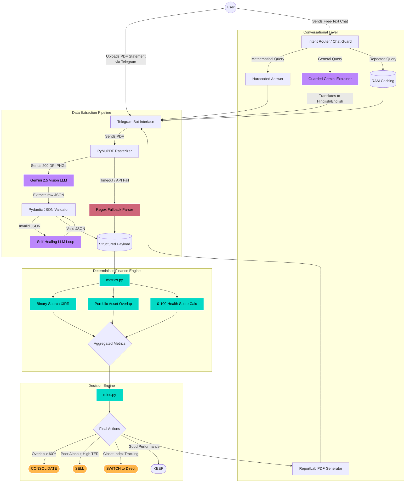

# ArthaScan System Architecture

This document provides a high-level visual and structural breakdown of the ArthaScan prototype. The core philosophy of this architecture is **"Zero-Hallucination Finance,"** strictly isolating all mathematical and business logic from the generative AI models.

## 1. Top-Down Visual Flow

### Color Guide
- **Purple nodes:** Non-deterministic generative LLMs.
- **Teal nodes:** Pure Python, 100% deterministic algorithms.
- **Red nodes:** Silent fail-safe mechanisms for API throttling.
- **Orange nodes:** Final, immutable system directives.

---

## 2. Component Explanations (The 1-Pager)

### Phase 1: Multimodal Data Extraction
A major vulnerability of financial GenAI tools is that standard text-crawlers (like `PyPDF`) routinely mangle complex statement tables, leading to bad data before the analysis even begins. 
ArthaScan solves this by avoiding text processing entirely. The **Image Rasterizer** utilizes `PyMuPDF` to convert the critical first two pages of the document into high-resolution 200 DPI images. These images are fed directly into the **Gemini 2.5 Flash Vision LLM**, which structurally "reads" the tabular data exactly like a human accountant. 

To guarantee pipeline stability, the extracted text is forced through a strict **Pydantic Validation Loop**. If Gemini outputs malformed JSON, the script intercepts the failure and recursively prompts Gemini to repair its own syntax errors.

### Phase 2: The "Zero-Hallucination" Sandbox
Large Language Models cannot do math reliably. Therefore, LLMs are permanently banned from performing financial computations in this architecture. 
The validated JSON payload is passed to a strict, walled-off **Deterministic Financial Engine**.
- **The XIRR Engine:** Instead of estimating returns, a native Python binary-search algorithm executes standard `XNPV` calculations against exact cashflow dates to determine True Annualized Returns.
- **The Duplication Engine:** Individual stock holdings across all mutual funds are weighted, normalized, and intersected to reveal hidden asset overlap.
- **10-Year Wealth Bleed:** Calculates exact value erosion by comparing the user's high Expense Ratio (TER) against a 0.1% baseline compounded over a decade.

### Phase 3: Rigid Decision Hierarchy
The math engine passes aggregated financial truths into the **Rules Engine**. This is a hardcoded heuristic tree that issues absolute financial directives. For example, if a fund exhibits an Extracted Overlap of >60%, the engine triggers an automatic `CONSOLIDATE` action. If a fund is designated a "Closet Indexer" (high `R-Squared` tracking but heavily charging the user), it triggers a `SWITCH` action.

### Phase 4: "Glass-Box" Presentation & Chat Guards
Once the math is decided, we use LLMs strictly as a UI translation layer. 
Instead of a rigid chatbot, users interact with an asynchronous **Intent Router**. If a user asks a definitive math question (*"What is my overlap?"*), the system bypasses AI entirely and returns the deterministic answer. 
If the user asks a conversational question (*"Why is this fund bad?"*), the router injects the deterministic payload into a strict systemic prompt, commanding the **Guarded Gemini Explainer** to answer the question using *only* the provided math, effectively translating dry JSON into fluid conversational English or Hinglish without hallucinations. 

To ensure presentation-layer stability, all generated LLM responses are hashed and stored in an in-memory **RAM Cache**, resulting in 0ms latency for repeated user interactions during high-load demos.
